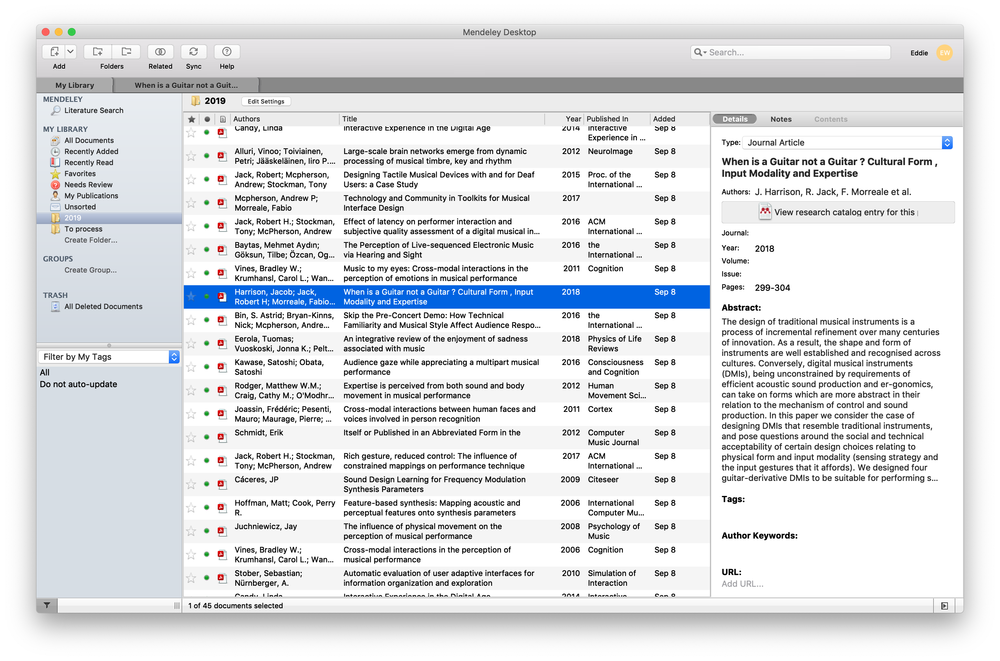

# Images

Walls of text can be boring, particularly if you can explain a point better with a referenced image called a figure.

The standard Markdown command for inserting an image is:

``````

However, Markdown on Overleaf works slightly differently. The caption section in the square brackets is actually used as a name to insert the image into figure table. To add a caption (and you should _always_ add a caption), add the caption after the file location between speech marks like this:

``````

To insert the file ```img/mendeley.png``` into this document with the caption 'Mendeley reference manager' and the figure reference 'mendeley', I would type the following:

``````

At the end of this sentence I insert the image using the above command. However, you are unlikely to see it exactly where you insert it, as LaTeX places it in a place appropriate to the document format that you are using.  

This is why it is important to give your images a proper reference name in the square brackets. Once you have done so, you can refer to the image in the body text by using the LaTeX command ```\ref{fig:imagereference} ```, which auto-generates a link to the figure number for that image.

For example, the phrase **Figure \ref{fig:mendeley}** is autogenerated by the code ```**Figure \ref{fig:mendeley}**```:

- The two asterisks are Markdown code for *Bold text*

- 'Figure' is just normal text

- The \\ref{fig:mendeley} code auto-generates the link to the image as a numerical reference.

- the two final asterisks turn off the bold text.

The full details of how Markdown works on Overleaf can be found online here: [How to write in Markdown on Overleaf](www.overleaf.com/learn/latex/Articles/How_to_write_in_Markdown_on_Overleaf)  

## A note about the file structure of this Overleaf document

In this template I have created a sub-folder on the file system called ```img```. I prefer to have my images in a sub-folder to keep the main folder tidy. You can see the folder structure to the left in Overleaf, and the ```img``` folder has an arrow on it so that it can be folded out of the way when you don't need to see the contents. Handy.

Alongside the ```img``` folder, this main folder contains only the following files:

- Markdown-formatted text files for each section, numbered sequentially so that they stay in the appropriate order when sorted alphabetically:

    - 01.introduction.md

    - 02.second-section.md

    - 03.images.md

- The _main.tex_ file which sets up the document type, contains the author name and document title, and pulls in the Markdown text.

- The _references.bib_ file, which is simply a text file containing BibTeX-formatted references which are generated from your reference manager of choice, i.e. Zotero, Mendeley, Endnote etc.

**Tip**: always put a 0 in front of filenames with single numbers so that ```chapter1``` and ```chapter2``` don't end up with ```chapter10``` inbetween them in the file list.

**Tip 2**: Name your Markdown files with the chapter or section name. I've named the files in this template to make sense specifically for this document. Change them to be useful for your own work.
